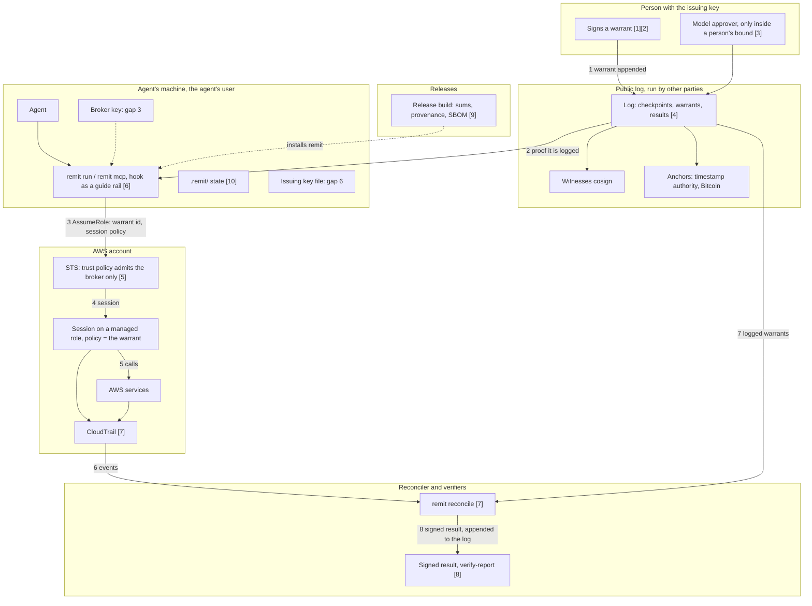

# Threat model

Status: 0.2, 2026-09-28. Supersedes draft 0.1 of 2026-09-24.
Read with `SPEC.md`; section numbers below refer to it.

This version is a STRIDE review of every component, checked against an independent red-team review of release 0.1.3 made the same day, which tried each threat against the code and reproduced what it could.
Where the review found a way around a claim, the fix is named below with the test that now fails without it.
What is not fixed is marked **Open** and says why.

## What Remit claims

Remit makes three claims, and this document asks of each threat which claim it attacks.

1. **Authorized.** Every session on a managed role was opened under a warrant that chains to a trusted root key and was logged before use.
2. **Bounded.** A session can do no more than its warrant grants, because the cloud provider enforces the policy compiled from it.
3. **Complete.** A reconciliation that says `complete` has joined every managed action in the provider's record to a warrant that permits it, and would have said `incomplete` otherwise.

A false `complete` is the worst failure Remit can have, worse than an outage, because people act on it.

## How to read the tables

| Status | Meaning |
| --- | --- |
| **Prevented** | The attack fails. The evidence is a test, a proof or the provider's documented enforcement. |
| **Detected** | The attack can succeed, and the reconciler or a verifier reports it; the verdict becomes `incomplete` or the verification fails. |
| **Accepted** | The attack is possible, is outside what Remit claims, and every result says so. |
| **Open** | The attack is possible and weakens a claim. It is listed in the known gaps with its fix. |

## Trust boundaries

Each box drawn around a group is a trust boundary; arrows are the data flow, numbered in order; `[n]` is the component's section below.
The two items marked **gap** are where the default setup puts something on the agent's side of a boundary.

The boundaries that matter are between the agent and three things it must not hold: the issuing key, the broker's credentials, and the log's and witnesses' keys.
Most of what is Open below is a place where the default setup puts one of them on the agent's side.

## Assets

- **Authority:** the issuing keys and the warrants they sign.
- **Cloud access:** the roles the broker can assume and the sessions it opens.
- **The record:** the log of warrants, records and results; its anchors; and the provider's own audit record.
- **The claim:** a result, and what its verdict is qualified by.

## Adversaries

Each is considered alone and together with the others.

| # | Adversary | Can |
| --- | --- | --- |
| A1 | A misbehaving agent (a bug, a bad instruction, prompt injection) | Take any action its credentials allow; write anything to its own files and logs |
| A2 | A compromised agent host | All of A1, and read every file and process environment of the agent's user |
| A3 | A delegating agent that over-delegates | Sign child warrants |
| A4 | An operator of Remit itself | Run the broker, the log and the reconciler |
| A5 | A person with their own cloud credentials | Act outside Remit entirely |
| A6 | A cloud administrator | Change roles, trust policies, resource policies and trails |
| A7 | A network attacker | Observe and alter traffic |
| A8 | A compromised dependency or build tool | Run code in the build, or in Remit itself |
| A9 | A person with an issuing key who acts in bad faith, or whoever stole it | Sign any warrant |
| A10 | Someone who wants a result to say more than it does | Choose the reconciler's inputs, or present a result out of context |
| A11 | Colluding witnesses | Cosign what the log operator asks |

## STRIDE by component

### 1. Issuing keys and signatures

| | Threat | Status | Evidence |
| --- | --- | --- | --- |
| S | A warrant signed without the issuing key | Prevented | Ed25519 with strict verification (SPEC 5.2); `signatures.rs`: a forged issuer fails, any altered byte is rejected. |
| S | A warrant signed by a key the verifier does not trust | Prevented | A chain must start at a trusted root; demonstrated on 2026-09-28 with an impostor key ("root issuer ... is not trusted"). |
| T | A warrant's bytes altered after signing | Prevented | Canonical encoding: the decoder re-encodes and compares, so only one byte string decodes to a warrant (`a_mutated_encoding_is_refused_or_is_exactly_canonical`). |
| T | A signature over one kind of document presented as another | Prevented | Domain separation: `REMITWv1` for warrants, `REMITRv1` for results, and the result signer refuses the warrant domain (`domain_signatures_do_not_cross_domains_or_impersonate_warrants`). |
| R | An issuer denies having issued a warrant | Detected | The broker honours only warrants proven logged, and the log is witnessed (section 9.3). |
| I | The issuing key is read by the agent | **Open** | `remit init` keeps the key in `~/.config/remit/root.key`, under the agent's own user when the agent runs as the person; the permission rules it prints do not stop a script (known gap 6). |
| E | A stolen or misused issuing key mints a broad warrant | Detected, partly | The warrant is public in the log before the broker honours it, so a person reviewing the log sees it; but the log does not prove that it was logged before its session was opened (known gap 7). |

### 2. Warrants, patterns and delegation

| | Threat | Status | Evidence |
| --- | --- | --- | --- |
| E | A child warrant grants more than its parent | Prevented | `check_attenuation` on every link of every chain; property tests of the attenuation theorem; the red team's exhaustive check of 115,600 pattern pairs found no false containment. |
| E | AWS reads a pattern more broadly than Remit does | Prevented | The compiler refuses whatever AWS would read differently, and policy variables (`everything_aws_would_read_differently_is_refused`). |
| E | A grant lets work escape the warrant: `iam:PassRole`, `sts:AssumeRole`, credentials or IAM changes that outlive it, resource policy changes, code that runs later, reads that return credentials (ECR tokens, database tokens, Secrets Manager values) | Prevented at issuance, unless allowed | New: `remit warrant issue` and `remit task` name each such grant and refuse without `--allow-escape` (`a_grant_that_escapes_the_warrant_needs_saying_so`). The list is the known ways out, not a proof there are no others; the role's own permissions remain the ceiling. |
| S | A warrant used by an agent other than its subject | **Open** | A warrant is a bearer credential: nothing binds the caller to the warrant's `subject`, and every warrant is public in the log, so anyone who can reach a broker can use any valid one, and the result names the wrong subject (known gap 5). |
| D | A long window that cannot be cut short | Accepted | No revocation (known gap 2). |

### 3. Model approvers (ADR 0008)

| | Threat | Status | Evidence |
| --- | --- | --- | --- |
| E | A fooled model widens what it approves | Prevented | An approver issues only inside a bound a person signed (`a_fooled_decider_never_widens_the_bound`). |
| S | A model's own risk rating is taken as authority | Prevented | AWS's own flags decide the band and overrule the model (`a_models_band_is_overruled_and_only_its_probability_counts`). |
| I | A secret read approved as a mere read | Prevented | Secret reads go to a person (`secret_reads_go_to_a_person_although_aws_calls_them_reads`). |

### 4. Log, witnesses and anchors

| | Threat | Status | Evidence |
| --- | --- | --- | --- |
| T | History rewritten, or two histories shown | Prevented, for a verifier with independent witnesses | A checkpoint is trusted only with a quorum of the verifier's witnesses, who cosign only consistent states and refuse a second history under the same key (`a_witness_refuses_a_second_history_under_the_same_key`). |
| T | The same, where the only witness is local | **Open** | `remit init` makes a local witness on the agent's machine; whoever controls the machine can recreate the log and have it cosigned (known gap 6). |
| S | A checkpoint trusted on the log's key alone | Prevented | New: a trust policy with quorum 0 is refused. |
| T | A proof presented for a chain it does not cover | Prevented | Leaves are recomputed from the chain's own bytes. |
| T | The chain file swapped between being checked and being proven | Prevented | New: `remit run` and `remit mcp` prove the bytes they planned from, not a second read of the file. |
| R | A rewrite past an anchored checkpoint | Detected, as far as the verifier keeps the anchors | Consistency with each kept checkpoint is checked; new: a directory with no anchors, or a receipt of an unknown kind, fails, and times are read from the token, not the operator's receipt. Whoever can delete the anchors can delete what they show, so a verifier keeps its own copies (known gap 8). |
| R | A timestamp authority's or Bitcoin's attestation forged | Accepted | Checked with the authority's own tools (`openssl ts -verify`, `ots verify`), and `verify-anchors` says so. |
| I | An account number published in the tiles | Prevented | New: `publish-log.sh` searches the tiles, which carry whole warrants, as well as the checkpoint; results are never published. |
| D | A witness is down | Accepted | The log goes on and is cosigned later (`a_witness_that_is_down_does_not_stop_the_log`). |

### 5. Broker and AWS enforcement

| | Threat | Status | Evidence |
| --- | --- | --- | --- |
| E | A session broader than its warrant | Prevented by AWS; Detected | The session policy is the warrant compiled verbatim with an `aws:CurrentTime` window, and the reconciler compares the recorded policy byte for byte (`a_broader_policy_under_a_real_warrant_id_is_caught`). |
| E | A session that outlives its warrant | Prevented; Detected | Duration is at most the role's maximum and the warrant's end less 60 s; the first live session's one-second overrun was caught (`the_first_live_session_outlived_its_warrant_by_one_second_and_was_caught`). |
| S | Someone with the broker's credentials opens sessions directly | Detected | New: a creation must come from a named broker, through `AssumeRole`, with exactly the five parameters the broker passes, so a copied policy with `PolicyArns` or session tags is caught; creations are recognized by the role AWS recorded, not the requested spelling; and every action must join by access key to a creation the run saw and checked (`a_session_created_with_anything_the_broker_never_passes_is_caught`, `a_session_on_a_managed_role_is_recognized_however_the_request_spells_it`, `an_action_by_a_session_whose_creation_was_not_seen_fails_the_run`). Prevention needs the credentials out of the agent's reach (known gap 3). Unverified: whether CloudTrail records `policyArns`; one `AssumeRole` with it settles that. |
| E | A resource policy grants a session more than its warrant | Detected where recorded | Known gap 1. Seen for real on 2026-09-28: the AWS-managed CodeCommit key's policy let CodeCommit decrypt for a reader session whose warrant grants no `kms:Decrypt`; being a service's call, it is counted under calls made on the session's behalf. |
| E | A session reaches another role by chaining | Prevented at issuance; Detected | `sts:AssumeRole` is an escape grant; new: a warrant's identifier on a session of any role is treated as the warrant's work and fails the join (`a_warrant_identity_on_a_chained_role_is_still_the_warrants_work`). |
| I | The command the broker runs sees the session's credentials | Accepted | It must, to act; they are the warrant's, last at most an hour, and everything done with them is recorded under the warrant's identifier. The program can print them (`aws configure export-credentials`), and through `remit mcp` that output reaches the agent. |
| D | STS throttles or is down | Accepted | Fails closed: no session. |

### 6. Agent host: `remit run`, `remit mcp`, the plugin and the hook

| | Threat | Status | Evidence |
| --- | --- | --- | --- |
| E | The agent reads the broker's credentials | **Open** | `remit mcp` runs as the agent's user, and a process of that user can read its environment from `/proc/<pid>/environ` (reproduced by the red team); a child can also open `~/.aws/credentials` by path, since only the environment is closed (known gap 3). |
| E | The agent runs its own program under a name `--allow` permits | Prevented | New: each `--allow` entry is resolved to its canonical file when the server starts, and only those files run (`only_the_allowed_files_run_whatever_they_are_called`). |
| E | An allowed program does more than expected (`aws` aliases run shell commands) | Accepted | The allow list chooses which program starts, not what it does; whatever it does in AWS runs under the session. |
| S | The agent replaces its current warrant with another logged one | **Open** | The bearer problem (known gap 5). |
| E | The agent runs `aws` without the hook noticing | Accepted | The hook is a guide rail, not a boundary; the red team bypassed it fifteen ways, as expected. |

### 7. The provider's record and the reconciler

| | Threat | Status | Evidence |
| --- | --- | --- | --- |
| R | A managed action with no warrant | Detected | `managed_actions_without_a_known_warrant_are_caught`. |
| E, R | A managed action that names no resource and that no grant covers | Detected | Was not: the red team reproduced a `complete` over `iam:CreateAccessKey` under a warrant for `s3:GetBucketLocation`. New: such an action is outside the warrant (`an_event_that_names_no_resource_fails_unless_a_grant_names_its_action`). |
| E | An operation whose permission has another name hides from, or falsely fails, the cross-check | Detected | New: the actions that authorize an event come from AWS's service reference for every service (499 operations differ), with S3's exact table first and CloudWatch's `monitoring` source mapped; a difference none of them knows fails closed (`an_event_is_checked_against_the_action_that_authorizes_it`). |
| S | A session creation disguised by spelling the role differently | Detected | New, as in component 5. |
| R | A session whose creation the run never saw: another region's STS endpoint, before the window, a chained role | Detected | New: the access-key join; creations are gathered from before the window as far back as the roles' longest session. |
| E | A trust policy that admits more than the broker (`sts:Assume*`, another account, a federated principal) | Detected | Was not; new: actions are read with IAM's wildcards and only the brokers may be admitted (`a_trust_policy_that_admits_anyone_but_the_broker_fails_the_run`). |
| T | The record altered | Detected with a validated trail | Digest chain verification (SPEC 6.7); from event history the verdict can only be `complete, unvalidated`. |
| R | The trail's scope narrowed: event selectors, global service events, regions | **Open** | Integrity is checked, scope is not (known gap 9); the access-key join now catches a missing creation, not a missing action. |
| R | Events delivered after the settling period | Accepted | Stated in every result; re-running the window confirms it. |
| R | A service acting in a session's name | Accepted | SPEC 6, assumption 4. New: recognized by `invokedBy` or by the service as the source address, as CodeCommit's forward-access calls were recorded, and counted by service and action instead of failing as unseen sessions. |
| D | An agent forces `incomplete` with actions the checks cannot read | Accepted | Fails closed; S3 object events are no longer checked against the bucket that contains them (the red team's claim that such events list the bucket is unverified, and the rule is harmless if they do not). |

### 8. Results and verification

| | Threat | Status | Evidence |
| --- | --- | --- | --- |
| S, T | A forged or edited result | Prevented | Signed over its exact bytes in the `REMITRv1` domain; `verify-report` checks the signer and the signature before parsing (a tampered report fails, checked 2026-09-28). |
| R | A verdict read without what qualified it: event history, a short settling period, fewer regions, refused inputs | Prevented | New: `verify-report` prints the source, settling period, run time, each role's trust policy, refused inputs, findings by kind and calls made on a session's behalf. |
| I | A result that names resources | Accepted | Counts by action never name resources, but findings do; results stay private, and only their signed commitments enter the public log. |
| S | The reconciler's key misused | Accepted | It is not an issuing key; anyone with read access to the record can re-run the window and compare. |

### 9. Build and distribution

| | Threat | Status | Evidence |
| --- | --- | --- | --- |
| T | A release binary replaced | Detected | SHA-256 sums, Sigstore build provenance (`gh attestation verify`), CycloneDX SBOM. |
| T | A build tool compromised to alter binaries or attestations | Prevented, as far as pinning reaches | New: Zig and cargo-zigbuild install by wheel hash, and the SBOM tool, at a fixed version, runs in a job with no permission to write the release or sign for it. |
| E | A vulnerable dependency | Detected for known advisories | `cargo audit` on every push and weekly; RustSec advisories fixed in 0.1.2. |

### 10. Project state on disk (`remit init`, `remit task`)

| | Threat | Status | Evidence |
| --- | --- | --- | --- |
| T | The agent edits or recreates the log, the witness state or the trust policy | **Open** | They live in the project directory the agent works in, under its user (known gap 6); the red team deleted and recreated the log and had the local witness cosign the new history. |
| I | Keys committed to the repository | Prevented | `remit init` writes `.gitignore` with `*.key`. |

## Does it hold up?

**Authorized** holds against a misbehaving agent (A1) and an over-delegating one (A3) when the issuing key and the broker's credentials are out of the agent's reach.
It does not hold against an agent that can read the issuing key, which the default single-user setup allows (known gap 6), or that uses another agent's valid warrant (known gap 5).
A warrant signed with a stolen key is public in the log, where people can see it, but the log does not yet prove it was there before the session (known gap 7).

**Bounded** holds for the agent's own sessions: AWS enforces the compiled policy, and nothing in this review found a way to make AWS enforce less.
The exceptions are resource policies that name the session or grant to everyone, which AWS applies on top (known gap 1), and grants that let work leave the warrant, which now need `--allow-escape` at issuance.

**Complete** now holds, for managed principals in the regions and event classes the record covers, against every way the red team produced a false `complete` from ordinary AWS behaviour: actions with no resource, sessions opened with extra parameters or by anyone but the broker, sessions whose creation the run did not see, chained roles, and loose trust policies.
Each is a test that fails on 0.1.3.
Run over the day's real record on 2026-09-28 (1,638 events), the reconciler joined all 19 warranted sessions and 121 warranted actions to checked creations, and counted 8 CodeCommit decrypts as calls made on a session's behalf.
It still depends on the trail's scope, which it does not check (known gap 9).

The single change that closes the most of what is Open is moving the broker off the agent's host: a broker that is a separate service with its own identity, holding no static key, and checking a signature by the warrant's subject before opening a session.
That closes known gap 3, makes known gap 5 fixable, and removes the reason the default setup keeps the log's keys beside the agent.

## Assumptions

Remit's guarantees depend on these, and each result restates the ones it relied on.

1. The cryptographic primitives hold: SHA-256 collision resistance, and the signature scheme (ADR 0003).
2. The cloud provider enforces its own policies as documented, and its audit record is written by the provider.
3. Issuing keys are held by the people they name, out of any agent's reach.
4. The broker's credentials are out of the agent's reach, so that only the broker opens sessions on the managed roles; the reconciler detects when this does not hold (known gap 3), but cannot prevent it.
5. Clocks are within 60 seconds of AWS's. The broker keeps that margin between a session's end and its warrant's end (SPEC section 8.1), and the reconciler checks every session against AWS's recorded time.
6. A verifier trusts witnesses the log's operator does not control, and keeps its own copies of anchors.

## Known gaps

Limits of the design as built, stated so that no one has to find them.

1. **A resource-based policy can grant around a warrant.** AWS: "A resource-based policy can specify the ARN of the session as a principal. In that case, the permissions from the resource-based policy are added after the session is created. The resource-based policy permissions are not limited by the session policy" (IAM user guide, session policies). When the record covers the action, the reconciler reports it as outside the warrant; a data event is recorded only where data events are configured (SPEC 6, assumption 2). Detected where recorded, never prevented.
2. **A warrant cannot be revoked before it expires.** A logged warrant is honoured until its window ends, and credentials already issued stay valid until they expire, at most the role's maximum session and never later than 60 seconds before the warrant ends (SPEC 8.1). Short windows are the mitigation until revocation exists.
3. **The broker's credentials within the agent's reach.** When `remit run` or `remit mcp` runs as the agent's user, the agent can read the broker's credentials (from the environment, `/proc`, or `~/.aws/credentials`) and call `AssumeRole` itself. Since this review, the reconciler catches every such session it can see: one with any parameter the broker does not pass, a caller other than the broker, a policy or duration that is not its warrant's, or actions whose creation it did not see. Detected, not prevented; prevention is a broker on another identity or host.
4. **Escape grants are the issuer's choice.** `--allow-escape` issues a warrant whose grants let work leave it; the warrant then bounds the call that does so, not what follows.
5. **A warrant is a bearer credential.** Nothing binds the session to the warrant's subject: whoever can reach a broker can use any valid logged warrant, and the result attributes the work to that warrant's subject. The fix is a broker that requires a fresh signature by the subject's key over the warrant identifier, a nonce and the time, and records the subject in the session.
6. **The default setup keeps the log, its local witness and the issuing key under the agent's user.** `remit init` is for trying Remit on one machine. There, the agent can recreate the log, lower the trust policy, or sign with the issuing key, and `init` says that its permission rules do not stop a script. In production, the issuing key belongs to people, the log to another identity, and the witnesses to other parties.
7. **The log does not prove a warrant was logged before its session.** The broker refuses unlogged warrants, but someone with an issuing key and the broker's credentials can open a session under a warrant's identifier first and log the warrant later. The fix is to require each warrant's entry in a checkpoint whose witness cosignatures are timestamped before the session's creation.
8. **Anchors protect only the verifier who keeps them.** Whoever can delete the anchors directory can delete what it shows. The fix is to publish receipts as record entries in the log, so that witnesses hold them.
9. **The trail's scope is not checked.** A validated trail proves its files are whole, not that it records every region, global service events, and the data events the warrants concern. An administrator who narrows it (A6) narrows what `complete` means without a finding. The fix is to read the trail's configuration (`GetTrailStatus`, `GetEventSelectors`) on every run and state it in the result.

## Out of scope

- Whether an authorized action was the right one. Remit records who allowed it.
- Side channels on the agent's host.
- The provider's internal integrity beyond what it documents and signs.
- Denial of service against the broker or the log, beyond failing closed: without the broker, an agent gets no credentials.

## Failure principles

- **Fail closed.** A warrant that cannot be verified, compiled within limits, or chained is refused; an event the reconciler cannot read fails the run rather than passing.
- **Never round up.** A limit that cannot be expressed exactly is a refusal, never an approximation, because an approximation is a different grant.
- **Say what was not checked.** A result that relied on an assumption it could not verify says so in the result, and a verification prints what it did not verify.
